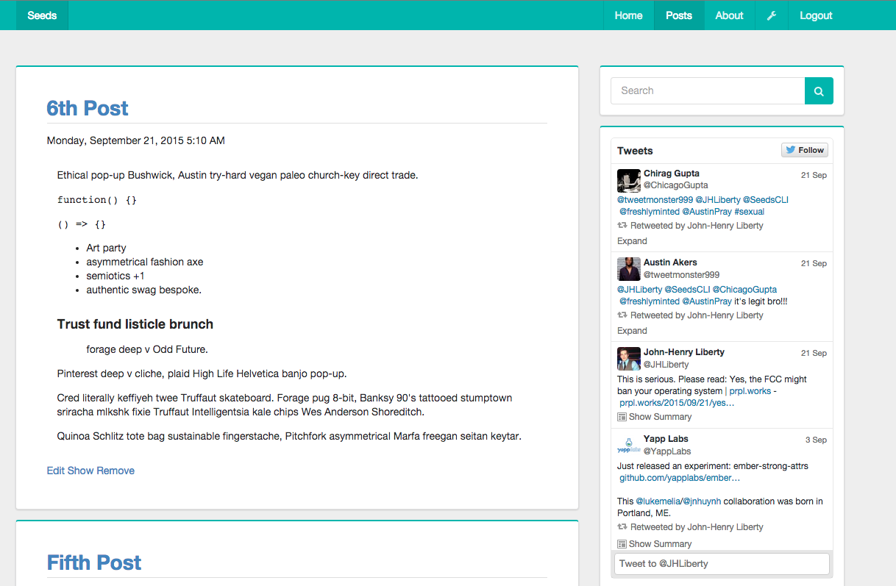

# Blog - Example [Seeds](https://github.com/terminalvelocity/seeds.js) Application

[](https://gitter.im/terminalvelocity/seeds.js?utm_source=badge&utm_medium=badge&utm_campaign=pr-badge&utm_content=badge)
[](https://waffle.io/terminalvelocity/seeds.js) 

Currently to get this application to run, cd into api and run `npm install`, then cd into frontend and run `npm install && bower install`. This is temporary until `seeds init` is implemented.

```
                                                         .
                                              .         ;
                 .              .              ;%     ;;
                   ,           ,                :;%  %;
                    :         ;                   :;%;'     .,
           ,.        %;     %;            ;        %;'    ,;
             ;       ;%;  %%;        ,     %;    ;%;    ,%'
              %;       %;%;      ,  ;       %;  ;%;   ,%;'
               ;%;      %;        ;%;        % ;%;  ,%;'
                `%;.     ;%;     %;'         `;%%;.%;'
                 `:;%.    ;%%. %@;        %; ;@%;%'
                    `:%;.  :;bd%;          %;@%;'
                      `@%:.  :;%.         ;@@%;'
                        `@%.  `;@%.      ;@@%;
                          `@%%. `@%%    ;@@%;
                            ;@%. :@%%  %@@%;
                              %@bd%%%bd%%:;
                                #@%%%%%:;;
                                %@@%%%::;
                                %@@@%(o);  . '
                                %@@@o%;:(.,'
                            `.. %@@@o%::;
                               `)@@@o%::;
                                %@@(o)::;
                               .%@@@@%::;
                               ;%@@@@%::;.
                              ;%@@@@%%:;;;.
                          ...;%@@@@@%%:;;;;,..
                    Plant some seeds, watch em grow
                        You reap what you sow
```


### Currently Implemented

- [x] Posts
- [x] Admin Section
- [x] Signup/Login Auth Logic working for Ember@2.0.2
- [ ] Comments
- [ ] Authorization
- [ ] Search Functionality
- [ ] Twitter Feed Deprecation and Error Ember@2.0.2 ([Open Issue Deprecations](https://github.com/aethermx/ember-cli-twitter-feed/issues/2)) ([Open Issue twitter-wjs node Error](https://github.com/aethermx/ember-cli-twitter-feed/issues/1))
- [ ] Deployed
- [ ] Production ready

Feel free to hack on it. If you have questions or run into any problems [open an issue](https://github.com/terminalvelocity/blog-seeds-example-application/issues) or chat with us on [gitter](https://gitter.im/terminalvelocity/seeds.js).

